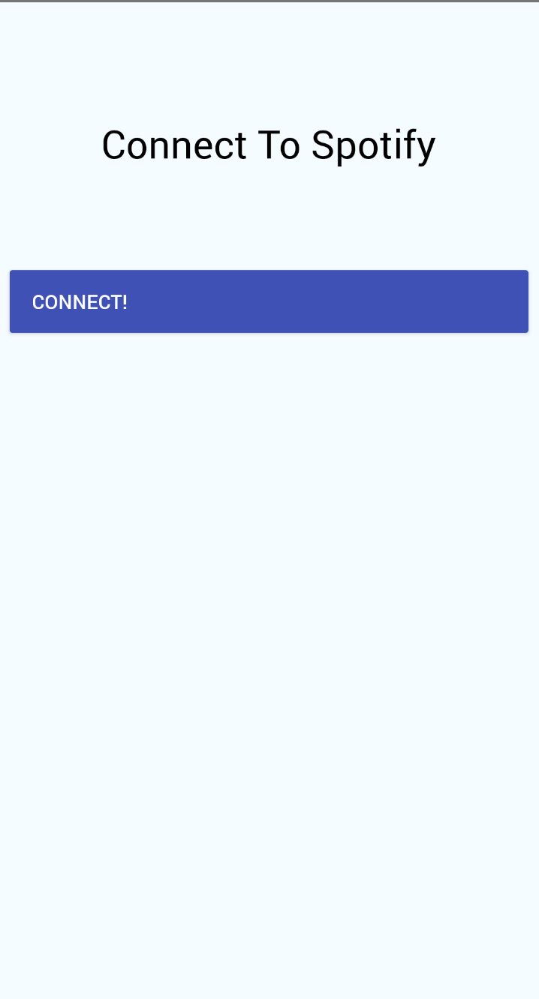
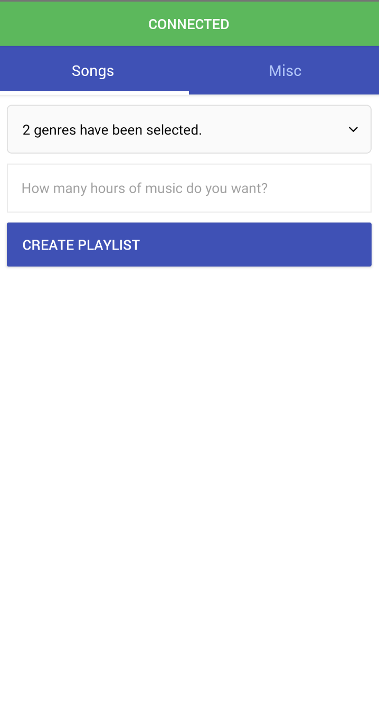
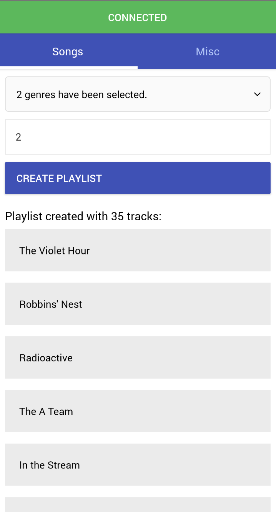
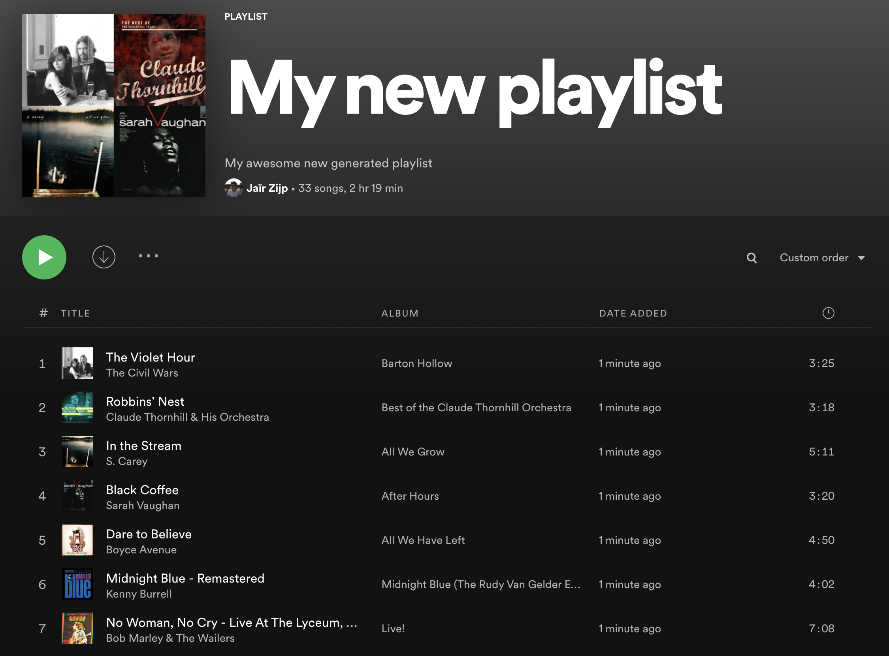

# Prototype Spotify Playlist Generator

Playing around in React Native and NodeJS

First connect to your Spotify Account\
\

Select up to 5 genres and specify the amount of hours of music you want in the playlist. And click on Create Playlist\
\

Boom! Your new playlist is created. See for yourself in Spotify :)\
\

